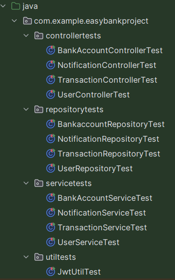

# Unit Testing And Coverage

____

## Introduction

____

JUnit is a popular testing framework for Java applications that provides a simple and effective way to write and execute unit tests. It allows developers to test individual units or components of their code in isolation, ensuring that each part of the application works as intended. In the context of the EasyBank application, JUnit testing has been used to verify the correctness and reliability of the system. Code coverage is a metric that measures the percentage of code that is executed during testing. In EasyBank, we have used JaCoCo to generate code coverage reports and ensure that the application is thoroughly tested.

____

## Unit Tests in EasyBank

____

Here is the test folder structure of EasyBank:

Total of 55 unit tests have been written for the EasyBank application. These tests cover various aspects of the application, including controllers, services, and repositories.

EasyBank uses several testing tools and frameworks:

`JUnit 5 (org.junit.jupiter)`: is used for writing and executing unit tests. It provides annotations and assertions to simplify the testing process.

`Mockito (org.mockito)`: Used for creating mock objects for dependencies like TransactionService, allowing isolation of the controller logic.

`Spring Boot Test (org.springframework.boot.test)`: Focused testing of Spring MVC controllers, allowing you to test controller logic without loading the entire application context.

`Spring MockMvc (MockMvc)`: Used to test Spring MVC controllers by simulating HTTP requests and responses.

`Jackson (ObjectMapper)`: Used to convert Java objects to JSON and vice versa, simplifying the testing of RESTful services.

____

## Code Coverage in EasyBank

____

Overall backend code coverage is 88.6%, which indicates that the majority of the code has been tested. Unfortunetly any of the frontend code has not been tested. This causes the overall code coverage to be lower(17%) than it could be. The coverage report is generated using JaCoCo, a popular code coverage tool for Java applications. It provides detailed information on the percentage of code that has been executed during testing, highlighting areas that require additional testing. The coverage report can be generated using the following command: **mvn clean test jacoco:report**

____