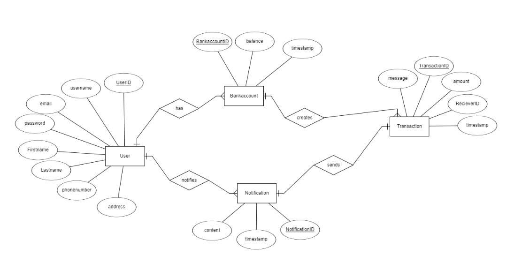

# ER Diagram

The ER diagram below shows the database schema for the EasyBank application. The database consists of four tables: `user`, `bankaccount`, `transaction`, and `notification`. The `user` table contains user's personal information, such as username, password, and email. The `bankaccount` table contains account information, such as account number, balance and timestamp. The `transactions` table contains transaction information, such as transaction ID, amount, timestamp, message and receiver account ID. The `notification` table contains notification information, such as notification ID, content and timestamp.

