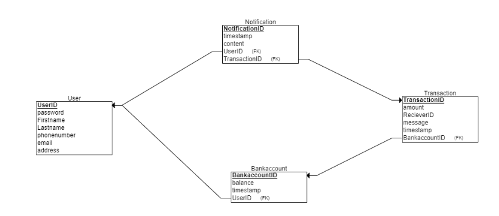

# Relational Schema

The relational schema for the `easybank` database is shown below. The schema is designed to store information about users, accounts, and transactions. The schema consists of the following tables:

